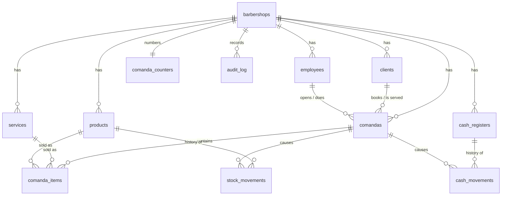

# Step 4 — Data (DRAFT, waiting for approval)

> Status: **draft.** The database, the saving layer and the tests are done.
> 3 points need your decision (section 11).
> Next step (5 — Communication) only starts after approval.

## 1. What this step delivers, in simple words

Until now the rules (step 3) were **pure functions**: they decide, but save
nothing, and the screens show **fake data**. This step creates the real place
where everything is kept, and the code that saves it **safely**:

- **A PostgreSQL database** with all the tables of the system.
- **Protections inside the database itself**, which work even if the code has a bug.
- **Commands**: each action (pay a comanda, close the day, …) loads what it needs,
  asks the **rule** from step 3, and saves **every effect together or none**.
- **Tests on a real PostgreSQL**, including two people acting at the same instant.

The screens are **not** connected yet. That is step 5.

## 2. Technical decisions

| Decision | Choice | Why | Cost / risk |
|----------|--------|-----|-------------|
| Database | **PostgreSQL ≥ 15**, hosted on **Supabase** (decided) | Reliable for money; has the features we need (see below). | We use only its PostgreSQL, not its web API or login (section 13). |
| How to define tables | **Plain SQL migrations** (`db/migrations/*.sql`) + the **`pg` driver**, **not Prisma** *(changes what step 1 suggested)* | The guarantees promised in steps 1 and 3 are PostgreSQL features that Prisma's schema file **cannot express**: Row Level Security, "only one open register" (partial unique index), append-only history (triggers), per-barbershop numbering. I would write them in raw SQL anyway, and Prisma would be one more layer (and Prisma 7 changed a lot). | We lose automatic typed queries. Compensation: typed repository functions + 116 database tests. If you prefer Prisma for the simple queries later, it can read this same schema. |
| Isolation between barbershops | **Row Level Security** + `barbershop_id` everywhere + composite foreign keys | Three independent locks (section 5). | See "what it does not cover". |
| Money | **integer cents** in every column | `0.1 + 0.2` problem (step 1). The driver refuses `45.5` for an integer column. | — |
| Ids | **UUID**, created by the application | Cannot be guessed or counted; known before saving. | — |
| Dates | **timestamptz** (UTC inside, shown in the shop's time zone) | Time zone is a setting per barbershop. | — |
| Deleting | **Never.** People, services and products are deactivated; items are marked as removed | Old comandas must keep pointing to them (rules R-EMP-03, R-SRV-03, R-CMD-21). The application role has **no DELETE right**. | The database only grows (fine for the MVP). |
| Stock and cash | **Derived** from movements (`SUM`), never a stored total | A stored total can drift away from its history. | Slightly more work per read; cheap with the indexes. |
| Tests | **Real PostgreSQL**, one database per test file, built from a template in milliseconds | A fake database would not prove Row Level Security, locks or triggers. | Needs a PostgreSQL to run (`npm run db:test-start` on Linux, or any PostgreSQL via `TEST_DATABASE_URL`). |

## 3. The data model



| Table | What it holds | Notes |
|-------|---------------|-------|
| `barbershops` | The barbershop and its **settings** (days for "sumido", automatic cancellation option, deadline, time zone) | Created by the platform admin, no self sign-up. |
| `employees` | Owner and barbers (role, active) | E-mail = login, unique in the whole system, lower case. No password here (step 5 chooses the login method). |
| `services`, `products` | Catalog | Products have no stock column. |
| `clients` | Name, phone (digits), notes | Phone unique per barbershop; erased clients keep the row without personal data (LGPD). |
| `cash_registers` | Opening, closing, counted cash, difference and reason, **cash left for tomorrow** | **Only one open per barbershop.** |
| `cash_movements` | Every money movement of a register | **Append-only.** Cash in the drawer = sum of the `cash` ones. |
| `comandas` | Status, client, discount, payment, note, **appointment**, **pending since**, **no-show**, cancellation | Number sequential per barbershop. Each status requires its own fields. |
| `comanda_items` | Items with the **name and price at the moment of the sale**, barber, "sold without stock" confirmation, removal mark | Never deleted. |
| `stock_movements` | Purchases, sales, reversals, losses, adjustments | **Append-only.** View `product_stock` = the sum. |
| `audit_log` | Who did what, when, with details | **Append-only.** |
| `comanda_counters` | Last number given by each barbershop | |

## 4. What the database refuses by itself

Each row is a rule from step 3 that now also lives **inside the database**.
The rules layer is the first line of defence; this is the second one, for the
day the code has a bug or two people act at once.

| Guarantee | Enforced by |
|-----------|-------------|
| One barbershop never sees another's rows | Row Level Security policy on every table |
| A row cannot point to a row of another barbershop | Composite foreign keys `(barbershop_id, id)` |
| Only **one open register** per barbershop (R-CSH-01) | Partial unique index |
| Same **phone** twice in a barbershop (R-CLI-02); same **e-mail** twice anywhere (R-EMP-01) | Unique indexes |
| Comanda numbers never repeat, **no gaps** | Counter row per barbershop |
| History cannot be edited or deleted — **not even by the database owner** | Triggers + no `UPDATE`/`DELETE` right for the application |
| The application cannot delete anything | No `DELETE` right |
| Each comanda status has the right fields (closed → payment; cancelled → reason ≥ 5 letters; no-show → appointment…) | `CHECK` constraints |
| Money is a whole number; prices > 0; quantity 1–20; discount needs an author; cash change = received − total | `CHECK` constraints |
| Cash difference and withdrawals/losses/adjustments need a **reason** (R-CSH-05, R-STK-05/06) | `CHECK` constraints |
| Sign of movements matches the type (a sale is positive money, a loss is negative stock…) | `CHECK` constraints |
| A barbershop keeps **at least one active owner** (R-EMP-02) | Constraint trigger (checked at commit) |
| Deadlines and time zone of the settings are valid | `CHECK` + trigger |

## 5. How the isolation between barbershops works (3 locks)

```
 request ─► withTenant(ctx) ─► BEGIN
                               set_config('app.barbershop_id', …, local to this transaction)
                               ├─ lock 1: every row has barbershop_id
                               ├─ lock 2: Row Level Security shows only the rows of that barbershop
                               └─ lock 3: composite foreign keys forbid links between barbershops
                             ─► COMMIT (or ROLLBACK on any error)
```

- **No barbershop set = no rows** (it fails closed, it does not show everything).
- The setting is **local to the transaction**, so it never leaks to the next user of the same pooled connection (tested), and it works with connection poolers.
- The application connects as `app_user`: not superuser, not owner of the tables, **cannot bypass** Row Level Security. `assertSafeAppRole` refuses to start the app with a stronger role.
- An automatic test guarantees that **only one file** (`src/db/client.ts`) talks about the current barbershop, and that no module imports the database driver directly.

**What this does NOT cover** (be aware):

- The **database owner / superuser** sees everything (the platform admin, migrations, backups). Keep that password out of the application.
- Two small functions look across barbershops on purpose, because the person is not logged in yet: `auth_lookup(email)` (login) and `email_taken(email)`. They return the minimum.
- The database does **not** check roles (owner/barber): the rules do. See "ctx" in section 8.

## 6. How saving works: the "command" pattern

Every action in `src/modules/*/data/commands.ts` does the same four things inside **one** transaction:

1. **Lock** what must not change under our feet (the comanda, the register, the products).
2. **Load** what the rule needs.
3. **Ask the rule** (step 3). If it refuses, **nothing is written**.
4. **Save every effect together**: the comanda + the cash movements + the stock movements + the audit entries.

| Command | What is saved together | Locks |
|---------|------------------------|-------|
| `closeComandaCmd` | comanda paid + cash movement + stock movements + audits | comanda, register (shared), products (shared) |
| `cancelComandaCmd` | comanda cancelled + **reversal** movements (money and products) + audit | same |
| `changePaymentMethodCmd` | new payment + 2 correction movements + audit | comanda, register |
| `closeDayCmd` | register closed + every comanda settled (discarded / no-show / pending) + audits | register (exclusive), every open comanda |
| `openRegisterCmd` | register + opening movement + audit (if different from yesterday) | database refuses a 2nd open one |
| `openComandaCmd` | comanda + number (the number is only used if the rule accepts: no gaps) | counter row |
| `recordWithdrawalCmd` | movement + audit | register (exclusive) |
| `adjustStockCmd` | adjustment + audit | product (exclusive) |
| `changeRoleCmd`, `setEmployeeActiveCmd` | change + audit | the barbershop row |
| `expirePendingCmd` / `runExpiryJob` | pending comandas cancelled by "system" + audits | pending comandas |
| others (`addItemCmd`, discount, no-show, clients, services, settings…) | change + audit when the rule says so | row involved |

Plus a read model for the screens: `getOpenRegisterReport` (expected cash, sales per method — **derived**) and `planDayCloseCmd` (the "Fechar caixa" alert list).

## 7. Races: two people at the same instant

Each case below is tested. For the **three that depend on a lock** (two
withdrawals, the same comanda paid twice, the register closed twice) the test
makes the second person arrive **while the first is in the middle of saving**
(a test trigger makes PostgreSQL sleep for 0.4 s), so the race really happens.
The others are decided by the database's unique indexes and counters whatever
the timing.

| Situation | Result |
|-----------|--------|
| The same comanda paid twice (barber and owner) | One payment. The other gets "comanda is not open". One cash movement, one stock movement. |
| The register closed twice | One closing. The other finds no open register. |
| Two withdrawals of R$ 70 from R$ 100 | One accepted, the other refused. |
| Two people open the register | One register. The other gets a normal refusal (not a crash). |
| 20 comandas opened together | Numbers 1…20, all different, **no gap**; a refused comanda uses no number. |
| Same client phone registered by two barbers | One saved, the other refused. |
| Same e-mail used by two barbershops | One saved, the other refused. |
| 15 purchases at once | Stock +15: none is lost (it is a sum). |
| Two owners demoting each other | Exactly one succeeds; the barbershop never ends without an owner. |

## 8. What I found while testing (real bugs, now fixed)

1. **The `NULL` trap in `CHECK` constraints.** PostgreSQL **accepts** a row when a `CHECK` gives "unknown". `length(reason) >= 5` is unknown when the reason is empty, so **an empty reason passed**. Five constraints looked protective and were not (reason of a stock loss, reason of a cash difference, price of a product for sale, amount of a discount that has an author, cash received vs payment method). **The tests found three**; I found the other two by reviewing every constraint for the same pattern, and added tests for them. All fixed, and there is a note at the top of the migration for whoever writes the next one.
2. **A decimal written in SQL is silently rounded.** `45.5` as a *literal* becomes 46; as a *parameter* (how the application always sends it) it is refused. The tests now cover the parameter case, and the rules only produce whole cents.
3. **A dead idle connection would crash the whole server** (Node.js stops on an unhandled `error` event). The pool now handles it.
4. **My own race test was too weak:** with a missing lock it still passed, because on a fast machine the first action ended before the second started. Now the race is **forced**, and the same test fails when the lock is removed.

## 9. Devil's advocate: risks and how they are handled

| Risk | Why it matters | Solution |
|------|----------------|----------|
| **The role of the logged-in person comes from the session.** If the owner demotes a barber's colleague, or deactivates someone, the old session still says "owner" | The database does not check roles; the rules trust `ctx.role`. A demoted owner could keep acting until the session ends | Step 5 must **read the role (and `active`) from the database on every request**, not from the cookie. Written in the handover (section 10). |
| **Editing `001_init.sql` after it is deployed** | Existing databases would not get the change | From the first real deployment the migration runner **refuses** a changed file (checksum): a new numbered file is added instead. (I edited `001` during development, before any deployment.) |
| **Using the owner connection in the application by mistake** | Row Level Security would silently stop working | `assertSafeAppRole` + automatic test: modules cannot import the admin connection. |
| **Comanda numbers serialize** | Two barbers opening a comanda wait for each other on one row | It lasts milliseconds; one barbershop opens a handful of comandas per hour. |
| **Row Level Security cost** | Every query carries the policy | Every index starts with `barbershop_id`; fine for the MVP. Measure with `EXPLAIN` at scale. |
| **Hosting and poolers** | Some providers force a connection pooler or a default role that bypasses Row Level Security | The tenant is set per transaction (works with transaction poolers) and the app uses its **own** role. Never use the provider's "service role". Supabase's ready-made roles are locked out by migration 002 (section 13). |
| **No offline mode** | The shop stops without internet | Unchanged: version 2 (step 1). |
| **Backups, retention, deleting a whole barbershop** | A restore that was never tried may fail when it is needed; a backup kept only at the provider is lost with the project | Daily backups (decision 3): `npm run db:backup` + automatic restore test + copy off-site (section 13). Off-boarding a barbershop and data export are not in the MVP. |
| **Stock can still go negative in a race** | Two barbers may each sell the "last" unit | Accepted (rule 3): the confirmation question is audited and the owner sees the negative stock. |

## 10. Handover to Step 5 (Communication)

The API / server actions must:

1. Build `ctx` **on the server**, from the login, reading `role` and `active` from the database on **every** request.
2. Call `withTenant(appPool, ctx, tx => someCmd(tx, ctx, …))`: one transaction per request. Never accept `barbershopId`, prices, totals or roles from the browser.
3. Turn `{ ok: false, error }` into a friendly message; the `code` tells what happened (`FORBIDDEN`, `WRONG_TENANT` = "not found", `NEEDS_CONFIRMATION` → show the confirmation screen, …).
4. Send to the browser only what the user may see (decision B: use `clientViewCmd`, never `SELECT *` from clients).
5. Pass an **idempotency key** for payments (same request twice must not charge twice): today the second attempt is refused by state, but a clear key is better when the connection drops.
6. Run `runExpiryJob` **once a day** (scheduled job with the owner connection).
7. Replace `src/prototype/mock-data.ts` with these commands; the demo data (`npm run db:seed`) is the same day the prototype shows.

## 11. Decisions for you

1. **Where will the real PostgreSQL live?** ✅ **Supabase** (decided). How we use it safely: section 13.
2. **Plain SQL migrations instead of Prisma?** ⏳ **Open.** You asked for the effects first; they are in the chat answer. Nothing else in the project depends on the answer for now (the screens and the rules do not change either way).
3. **Backups:** ✅ **Daily backups** (decided; no point-in-time recovery for now). What it really means in Supabase: section 13.

## 12. My verification of this step

- [x] **116 tests on a real PostgreSQL** + **186 unit tests** of the rules and the architecture. All pass, **3 runs in a row** (no flaky test).
- [x] **Isolation:** with no barbershop set the application sees **nothing** in 13 tables/views; with a barbershop it sees only its rows in every table; it cannot read, update, move or insert rows of another one; it cannot link data across barbershops, **not even with the owner connection**.
- [x] **History:** nobody can update, delete or truncate movements or the audit log, **including the database owner**.
- [x] **Atomicity:** a failure in the **last** step of a payment rolls back the comanda and the cash movement already written (tested by sabotaging the stock movement); once fixed, the same payment works.
- [x] **Races:** 9 situations (section 7). The 3 that depend on a lock are **forced** to really happen, and each fails when its lock is removed.
- [x] **Breaking the database on purpose:** 20 deliberate breaks (policy removed, foreign key weakened, unique index removed, history trigger removed, DELETE granted, numbering by `max()+1`, view without security, tenant leaking between transactions, a missing lock in 3 places, audit not saved, removed items not saved, errors not translated…). **19 caught.** The 20th (the expiry job not checking the option) changes nothing, because the rule already covers it: defence in depth.
- [x] **Real command-line tools tried:** `db:migrate` (twice: the second does nothing), `db:create-barbershop`, `db:seed` (a whole day through the real commands matches the prototype: cash R$ 128,50).
- [x] `npm run typecheck`, `npm run lint`, `npm run build` pass.
- [x] Supabase hardening (migration 002) and backup + **real restore** tested (12 new database tests).
- [ ] Owner answered the 3 decisions of section 11 (2 of 3 answered; the Prisma one is open).
- [ ] Owner approved this document.

## 13. Supabase: how we use it (and what it does not do for us)

Supabase is a PostgreSQL with extra services around it. We use **only the PostgreSQL**. Facts below were checked in Supabase's official documentation.

**Safety**
- Supabase creates three roles (`anon`, `authenticated`, `service_role`) and, by default, gives them rights on every new table, then offers a web API (the *Data API*) that uses them. **We never use that API**, so migration `002_lock_out_platform_roles.sql` removes every right of those three roles, on existing and future tables, views, sequences and functions (including the login function). It does nothing on a plain PostgreSQL. A test (`hosted.db.test.ts`) simulates Supabase's defaults, checks that the doors were really open before, and closed after. *In the Supabase dashboard, also turn the Data API off if you do not use it* (belt and braces).
- The application connects as **`app_user`** (never the `service_role` key, which ignores Row Level Security).

**Connections (3 kinds)**

| Used by | Connection | Why |
|---------|-----------|-----|
| `npm run db:migrate`, `db:backup` | **Direct** connection (or the pooler in *session* mode) | The migration holds a lock for the whole run; the *transaction* pooler would break it. The direct address is IPv6 only; if your machine has no IPv6, use the session pooler. |
| The running application (step 5) | **Pooler, transaction mode** | Many short-lived server instances. Our tenant is set per transaction (`set_config(..., true)`), so it is safe here. The user name has the form `app_user.<project-ref>`. |
| Tests | A local PostgreSQL | Never test against the real database. |

**Backups (decision 3: daily)**
- Supabase makes **automatic daily backups only on the paid plans** (Pro keeps 7 days, Team 14, Enterprise 30). **The free plan has none:** it is up to us. `npm run db:backup` saves a full copy to one file; schedule it daily and copy the file **outside** Supabase (another cloud or disk), otherwise a lost project loses its backups too.
- Point-in-time recovery (restore to any second) is a paid add-on and replaces the daily backups. Not chosen: with daily backups, **up to 24 hours of data can be lost** in the worst case. It is a conscious risk that must be told to each shop (a day of comandas and cash would have to be re-typed by hand from Pix receipts and notes).
- **A backup that was never restored is only a hope.** `backup.db.test.ts` saves a database with data, restores it into a new one and checks that the data, Row Level Security and the history protection are still there. Doing the same once with the real Supabase project is part of step 6.
- How to restore: (1) create an empty database; (2) make sure the role `app_user` exists on the server (**roles and their passwords are not inside backups**: create it, then `ALTER ROLE app_user PASSWORD ...`); (3) restore the file with `pg_restore`. The backup does not include files stored in Supabase Storage (we do not use it). A restore means downtime.
- `pg_dump` must be the same version as the server or newer (`PG_DUMP_BIN` chooses the program).

## Glossary

- **Migration:** a numbered file that changes the database structure. Applied once, in order, never edited afterwards.
- **Row Level Security (RLS):** a PostgreSQL feature where each table has a policy that decides which rows each connection may see.
- **Tenant:** one customer of the SaaS = one barbershop.
- **Transaction:** a group of changes saved all together or not at all.
- **Lock:** a "wait for me" sign on a row, so two people cannot change it at the same time.
- **Race (race condition):** a bug that only appears when two things happen at almost the same instant.
- **Append-only:** only new lines can be added; nothing is edited or deleted.
- **Idempotent:** doing the same request twice has the effect of doing it once.
- **Connection pool / pooler:** a set of ready database connections shared by many requests.
